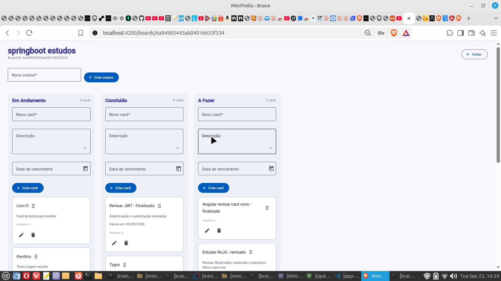
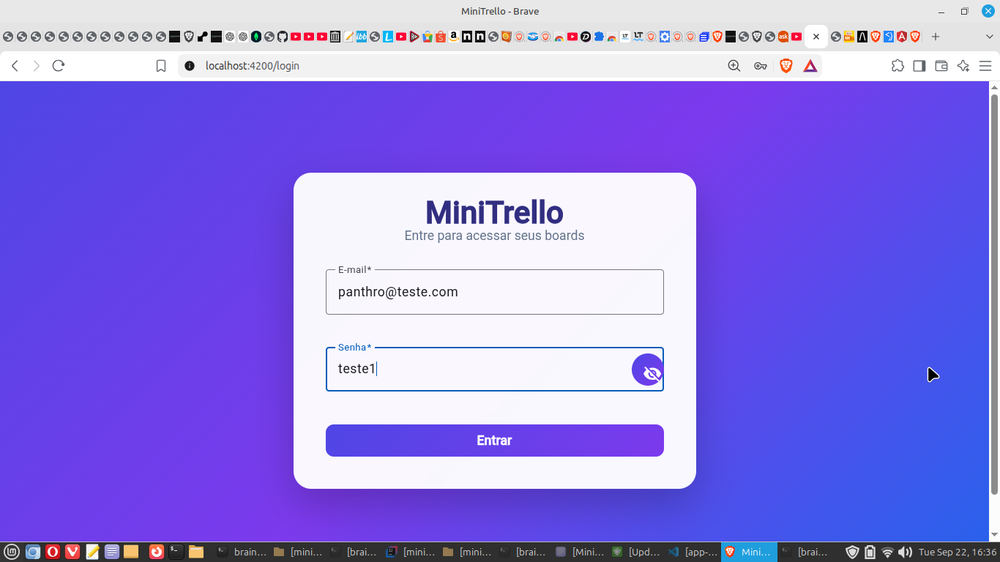
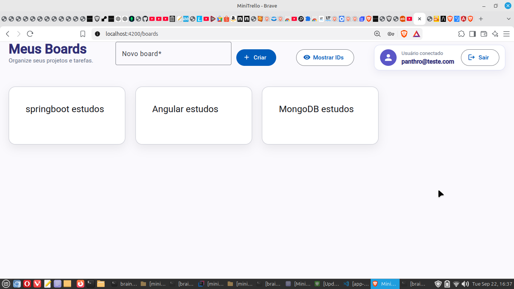
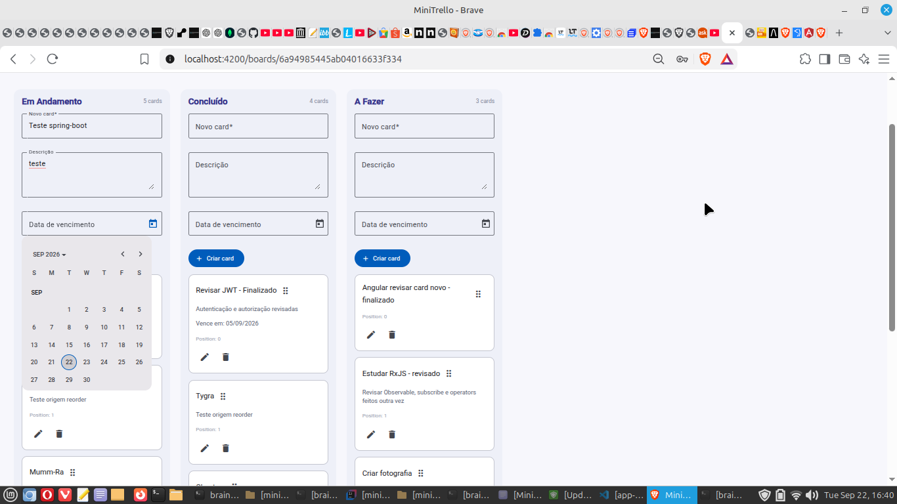
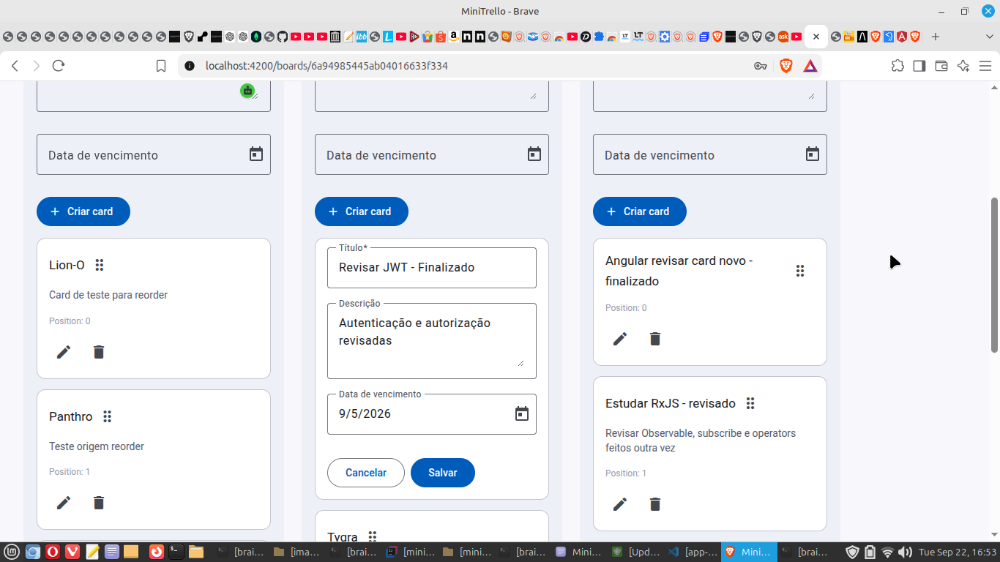
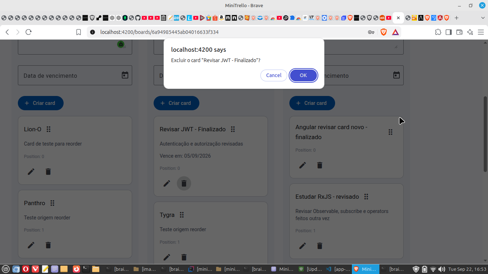

# MiniTrello


Aplicação full stack inspirada em um quadro Kanban, desenvolvida para estudo e prática de **Angular**, **Spring Boot**, **Spring Security**, **JWT** e **MongoDB**.

O projeto permite organizar tarefas em boards e colunas, criar e editar cards, definir datas de vencimento e movimentar cards por **Drag & Drop**, mantendo a nova organização persistida no backend.



---

## Funcionalidades

- Autenticação de usuários com JWT
- Proteção de rotas no frontend
- Boards vinculados ao usuário autenticado
- Criação de boards
- Criação de colunas
- Criação, edição e exclusão de cards
- Confirmação antes da exclusão de cards
- Ordenação dos cards por posição
- Drag & Drop dentro da mesma coluna
- Drag & Drop entre colunas
- Persistência da nova posição dos cards no backend
- Reordenação automática após criação, movimentação e exclusão
- Rollback visual em caso de falha na persistência do Drag & Drop
- Feedback de sucesso e erro com Angular Material Snackbar
- Data de vencimento opcional para cards
- Angular Material Datepicker
- Persistência das datas no MongoDB
- Exibição do usuário atualmente conectado
- Logout
- Visualização opcional dos IDs dos boards

---

## Tecnologias

### Backend

- Java 17
- Spring Boot 4.1.1
- Spring Web
- Spring Security
- OAuth2 Resource Server
- JWT
- Spring Data MongoDB
- Bean Validation
- Lombok
- Maven

### Frontend

- Angular 20
- TypeScript
- Angular Material
- Angular CDK
- Reactive Forms
- Angular Router
- RxJS
- SCSS

### Banco de dados

- MongoDB

---

## Interface

### Login

A aplicação possui autenticação por e-mail e senha. Após o login, o JWT recebido do backend é utilizado nas requisições protegidas.



### Boards

Cada usuário autenticado acessa seus próprios boards.

A tela também apresenta o usuário conectado, criação de novos boards, logout e opção para exibir os IDs.



### Quadro Kanban

Dentro de um board, as tarefas são organizadas em colunas e cards.


---

## Drag & Drop

Os cards podem ser movimentados:

- dentro da mesma coluna;
- entre colunas diferentes.

A nova posição é persistida no backend.

O projeto também implementa reordenação automática das posições dos cards, evitando posições inconsistentes após operações de criação, movimentação e exclusão.

Durante a persistência do Drag & Drop, a interface apresenta feedback visual. Caso a atualização no backend falhe, o frontend realiza **rollback**, restaurando o estado anterior.

---

## Data de vencimento

Os cards podem possuir uma data de vencimento opcional.

A seleção é realizada com **Angular Material Datepicker**.



No frontend, o formulário trabalha com:

```text
Date | null
```

Antes do envio para a API, a data selecionada é convertida para uma representação ISO em UTC.

Fluxo simplificado:

```text
Angular Material Datepicker
        ↓
Date | null
        ↓
Date.UTC(...)
        ↓
ISO 8601
        ↓
Spring Boot Instant
        ↓
MongoDB ISODate
```

A apresentação da data no card utiliza o formato:

```text
dd/MM/yyyy
```

---

## Edição de cards

Cards existentes podem ter título, descrição e data de vencimento alterados.



A data também pode ser removida. Nesse caso, o card permanece sem `dueDate`.

---

## Exclusão de cards

Antes da exclusão, a aplicação solicita confirmação do usuário.



Após a exclusão, as posições dos cards restantes são reorganizadas automaticamente.

---

## Autenticação e segurança

O backend utiliza **Spring Security** com autenticação baseada em JWT.

Fluxo simplificado:

```text
Login
  ↓
Spring Security
  ↓
JWT
  ↓
Angular armazena o token
  ↓
HTTP Interceptor
  ↓
Authorization: Bearer <token>
  ↓
Endpoints protegidos
```

No Angular, um interceptor adiciona o token às requisições protegidas.

Um `AuthGuard` impede o acesso às páginas protegidas quando não existe uma sessão autenticada.

O backend também valida a relação entre os recursos:

```text
User
  ↓
Board
  ↓
Column
  ↓
Card
```

Assim, o acesso aos recursos é validado a partir do usuário autenticado.

---

## Estrutura do projeto

```text
mini_trello_01/
│
├── backend/
│   └── mini_trello_01/
│       ├── src/
│       ├── pom.xml
│       └── mvnw
│
├── frontend/
│   └── mini-trello/
│       ├── src/
│       ├── angular.json
│       ├── package.json
│       └── package-lock.json
│
├── database/
│   └── mongodb/
│       ├── dump/
│       └── README.md
│
├── docs/
│   └── images/
│
├── api.sh
├── .gitignore
└── README.md
```

---

## Principais recursos da API

A API está organizada em torno dos seguintes recursos:

```text
/api/auth
/api/boards
/api/boards/{boardId}/columns
/api/boards/{boardId}/columns/{columnId}/cards
```

Entre as operações implementadas estão:

```text
POST   /api/auth/register
POST   /api/auth/login

POST   /api/boards
GET    /api/boards

POST   /api/boards/{boardId}/columns
GET    /api/boards/{boardId}/columns

POST   /api/boards/{boardId}/columns/{columnId}/cards
GET    /api/boards/{boardId}/columns/{columnId}/cards

PUT    /api/boards/{boardId}/columns/{columnId}/cards/{cardId}
DELETE /api/boards/{boardId}/columns/{columnId}/cards/{cardId}
```

---

## Executando o projeto

### Pré-requisitos

Para executar o projeto localmente:

- Java 17
- Node.js
- npm
- Angular CLI
- MongoDB

---

### Backend

Entre no diretório:

```bash
cd backend/mini_trello_01
```

Defina o segredo utilizado para assinatura dos tokens JWT:

```bash
export JWT_SECRET='seu-segredo-local'
```

Execute:

```bash
./mvnw spring-boot:run
```

Por padrão, o backend é executado em:

```text
http://localhost:8081
```

---

### Frontend

Em outro terminal:

```bash
cd frontend/mini-trello
```

Instale as dependências:

```bash
npm install
```

Execute:

```bash
ng serve
```

A aplicação ficará disponível em:

```text
http://localhost:4200
```

---

## Configuração da API no Angular

Os endpoints do frontend são centralizados em:

```text
frontend/mini-trello/src/app/core/api.config.ts
```

Durante o desenvolvimento local, o frontend utiliza:

```text
http://localhost:8081/api
```

A configuração também possui tratamento para acesso através de endereços de rede privada.

---

## MongoDB

O projeto utiliza MongoDB para persistência.

As principais coleções são:

```text
users
boards
columns
cards
```

A relação entre os documentos é mantida através dos identificadores utilizados pela aplicação.

---

## Backup e restore do MongoDB

O repositório inclui um **dump de demonstração** destinado a testes de backup e restore.

Os arquivos estão em:

```text
database/mongodb/
```

A documentação específica está disponível em:

```text
database/mongodb/README.md
```

O dump público utiliza dados de demonstração e foi mantido separado dos dados utilizados durante o desenvolvimento.

---

## Utilitário de linha de comando

O arquivo:

```text
api.sh
```

foi utilizado durante o desenvolvimento para testar a API diretamente pelo terminal.

Ele auxilia em operações como:

```text
register
login
logout
show_token
test_token
create_board
boards
create_column
columns
create_card
cards
update_card
delete_card
```

Isso permitiu testar o backend independentemente da interface Angular durante a evolução do projeto.

---

## Conceitos praticados

O MiniTrello foi desenvolvido como projeto de estudo full stack e permitiu praticar, entre outros conceitos:

- APIs REST
- autenticação JWT
- Spring Security
- autorização baseada no usuário autenticado
- MongoDB com Spring Data
- validação de dados
- tratamento de erros HTTP
- Angular Reactive Forms
- HTTP Interceptors
- Route Guards
- Angular Material
- Angular CDK Drag & Drop
- estado otimista e rollback
- persistência de ordenação
- datas entre frontend, backend e banco de dados
- backup e restore do MongoDB
- organização e documentação de um projeto full stack

---

## Autor

**Marcel Motta**

Projeto desenvolvido para estudo e prática de desenvolvimento full stack com Angular, Spring Boot e MongoDB.
